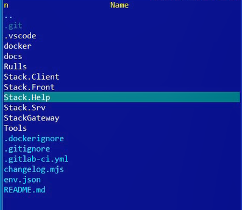
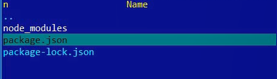
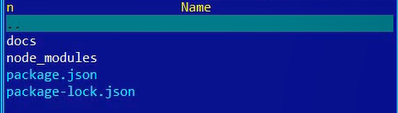
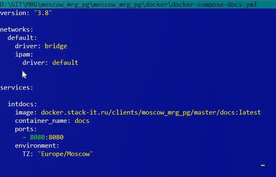
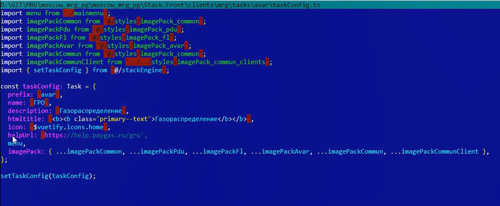

# Создание проектной документации (Help) для клиентов

## Видео
<!-- ССЫЛКА -->
   

<video width="560" height="240" controls>
  <source src="./media/%D0%A1%D0%BE%D0%B7%D0%B4%D0%B0%D0%BD%D0%B8%D0%B5%D0%9F%D1%80%D0%BE%D0%B5%D0%BA%D1%82%D0%BD%D0%BE%D0%B9%D0%94%D0%BE%D0%BA%D1%83%D0%BC%D0%B5%D0%BD%D1%82%D0%B0%D1%86%D0%B8%D0%B8%D0%94%D0%BB%D1%8F%D0%9A%D0%BB%D0%B8%D0%B5%D0%BD%D1%82%D0%BE%D0%B2.m4v" type="video/mp4">
  Your browser does not support the video tag.
</video>

## Инициализация VuePress

Для инициализации VuePress выполняем следующие действия:

1. На уровне Stack.Front и Stack.Srv создаем каталог Stack.Help. В нём будет храниться документация.

    

2. Открываем терминал в каталоге Stack.Help и инициализируем проект

    ```command-line
    npm init -y
    ```

3. Также выполняем команду для загрузки node_modules

    ```command-line
    npm install -D vuepress
    ```

    Так будет выглядеть каталог Stack.Help
    

4. В файл package.json добавляем скрипты для работы с VuePress

    ```js
    "scripts": {
        "docs:dev": "vuepress dev docs",
        "docs:build": "vuepress build docs"
    }
    ```

    команда ```npm run docs:dev``` позволяет использовать VuePress в режиме разработчика

    команда ```npm run docs:build``` позволяет собрать и опубликовать на веб-сервере

5. В файл .gitignore вписываем новый путь к каталогу node_modules, а также .temp и .cache

    ```gitignore
    Stack.Help/node_modules/*
    .temp
    .cache
    ```

6. В каталоге Stack.Help создаем каталог Docs. В нём будет располагаться документация в формате MarkDown.

    

7. Делаем коммит

## Создание или добавление документации

Если документации ещё нет, просто создаем новую в каталоге Docs в формате .md

Если документация уже существует:

1. Переписываем пути для каждого MarkDown файла существующей документации. Например, заменяем каталог "/Clients/" на "../". Это необходимо для правильной работы ссылок.

    

2. Делаем коммит и добавляем его в наш проект

3. Обращаемся к специалистам по инфраструктуре (отдел Макса Герасимова) для создания нового докер-контейнера

   

4. Согласуем с заказчиком ссылку, по которой у них будет располагаться документация.

5. В файле taskconfig.ts прописываем эту ссылку в поле helpUrl
    